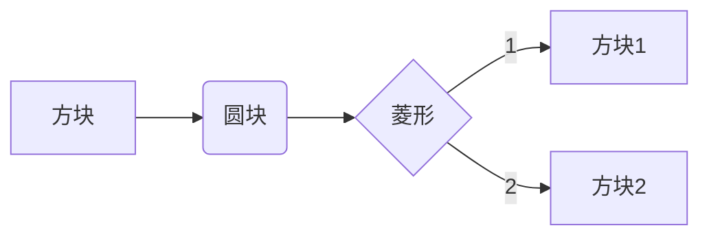

mermaid的markdown语法
graph LR
A[方块] --> B(圆块)
B --> C{菱形}
C --> |1| D[方块1]
C --> |2| E[方块2]


很遗憾，上述语法只能在typora中使用，hexo中是看不到的

只不过可以通过
```
npm install hexo-simple-mindmap
```
的方式安装一个使用起来相对简单的思维导图插件，顺便也测试一下
```

- [Hexo 的思维导图插件](https://hunterx.xyz/hexo-simple-mindmap-plugin-intro.html)
  - 前言
  - 使用方法
    - 一
    - 二
    - 三
  - 太长不看
  - 参考资料

```

- 内存管理
	- 程序执行过程
    	- 编译、链接、装入
    	- 逻辑地址和物理地址
    - 扩充内存————覆盖与交换
    - 连续分配
    	- 单一连续分配
    	- 固定分区分配————内部碎片
    	- 动态分区分配
    		- 外部碎片
    		- 分配算法：首次、最佳、最坏、邻近适应
    - 非连续分配
    	- 页式存储管理
    		- 概念：页面、地址结构、页表
    		- 地址变化机构及变换过程
    		- 快表
    	- 段页式存储管理————段表、地址变换机构、段的共享与保护
    	- 段页式存储管理————段表、页表
    - 虚拟内存
    	- 概念
    		- 局部性原理
    		- 特征：多次性、对换性、虚拟性
    	- 请求分页
    		- 组成：页表机构、缺页中断机构、地址变换机构
    		- 页面置换算法
    			- 最佳置换（OPT）
    			- 先进先出（FIFO）————Belady异常
    			- 最近最久未使用（LRU）
    			- 时钟（CLOCK）算法
    		- 页面分配策略————预调页策略、请求调页策略
    		- 抖动、工作集 	
	  		

实在是太大了，不太好用，只能轻量级的使用一下，还算可以吧